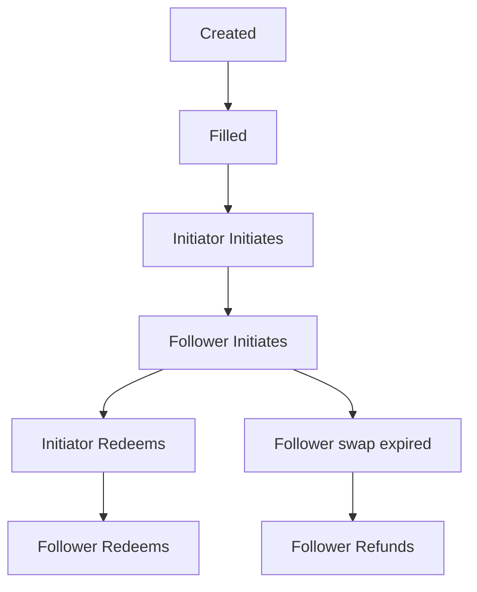

# COBI 

COBI is an automated trading system that contributes liquidity to the [garden](https://garden.finance/) orderbook AMM. It is designed to be a set-and-forget system that can be deployed on a server and left to run indefinitely.
COBI fulfills the role of filler in the orderbook AMM. It fetches available open orders from the Catalog orderbook and fills them with the best price according to the configurable strategy it is given with.It can be run by anyone who has a filler role in the garden governance system.


## Features

- **Configurable Filling Strategy**: COBI can be configured with a strategy that determines which orders it should fill.
- **Automated Trading**: Filled orders are executed on-chain according to the atomic swap protocol.
- **Gas Optimized**: COBI uses the latest gas estimation techniques to ensure that transactions are confirmed quickly and cheaply.
- **Delegator Rewards**: COBI can be run by anyone who has a filler role in the garden governance system. The delegator of the filler will receive a portion of the trading fees generated by COBI in exchange for increasing credibility as a filling in the orderbook AMM.

## Setup

### Prerequisites
- Fire up redis instance and set the `REDISCLOUD_URL` environment variable to the URL of the redis instance.

### Environment Variables

- `BITCOIN_INDEXER`: URL of the Bitcoin indexer.
- `DELEGATOR_FEE`: The percentage of trading fees that the delegator will receive.
- `<ETHEREUM_CHAIN_OPTION>_SWAP_CONTRACT`: The address of the Ethereum swap contract.
- `<ETHEREUM_CHAIN_OPTION>_URL`: The URL of the Ethereum node.
- `EVMS`: The Ethereum chain option. (e.g. `ethereum_mainnet`, `ethereum_sepolia`)
- `NETWORK`: The network that COBI is running on. (e.g. `mainnet`, `testnet`, `regtest`)
- `ORDERBOOK_URL`: URL of the Catalog orderbook.
- `PRIVATE_KEY`: The private key corresponding to bitcoin and ethereum address holding the funds.(It is recommended to generate a new private key and transfer funds to address calculated by COBI)
- `REDISCLOUD_URL`: URL of the Redis database.


### Start COBI

Construct environment variables in a `.env` file and run the following commands to start COBI.

#### Build from source

```
docker-compose ip --build -d
```

#### Use pre-built image

```
docker-compose up -d
```

### Strategies

Strategies define when COBI should fill an order. 
One can define a strategy by setting the following parameters:
1. `OrderPair`: The pair of assets that the strategy should fill orders for.
    - The pair should be in the format `chain:asset-chain:asset`.
    - chain is the chain name of the asset. (e.g. `bitcoin`, `ethereum`) 
    - asset is the address of the htlc contract of a token.
    - assets can be found in [garden documentation](https://docs.garden.finance/) .
2. `Makers`: A list of addresses that the strategy should fill orders for. If this is nil, COBI will fill orders for all makers.
    - makers are ethereum addresses
3. `MinAmount`: The minimum amount of the base asset that the strategy should fill.
4. `MaxAmount`: The maximum amount of the base asset that the strategy should fill.
5. `Fee`: The fee in bips that the order maker is willing to pay for the swap.

#### Example strategy:
```go
{
	OrderPair: "bitcoin_testnet-ethereum_sepolia:0x9ceD08aeE17Fbc333BB7741Ec5eB2907b0CA4241",
	Makers:    []{"0x9ceD08aeE17Fbc333BB7741Ec5eB2907b0CA4241"},
	MinAmount: big.NewInt(1000), // in sats
	MaxAmount: big.NewInt(100000), // in sats
	Fee:       10,
}
```

### COBI Components

#### Filler

The filler process is responsible for fetching open orders from the  orderbook and filling them according to the strategy.

- One routine is spawned for each strategy which opens a websocket connection to the orderbook and subscribes to updates for open orders for the strategy's order-pair.
- The orders are matched with the strategy and filled if it satisfies the strategy conditions.

#### Executor

The executor process is responsible for executing the filled orders on-chain according to the atomic swap protocol.

- The executor listens for filled orders from the filler process and executes them on-chain.
- There's an executor routine for each chain in the order-pair.
- Executor takes the swap to the next stage according the following flowchart:
  
**Note:  COBI executer acts as follower in the swap process.**




#### Ethereum Executor

- The swap details and next action are passed to the executor which interacts with the contract to execute the swap.
- Ethereum wallet contains the methods to interact with the HTLC contract.

#### Bitcoin Executor

- Bitcoin executor gets all the active orders every fixed duration to batch all the actions into a single transaction 
- It is ensured that a single transaction will be included in the next block by performing RBF if the latest transaction is not confirmed and carries lower fees that projected fees.
- Execution of multiple swaps in a single transaction is done by creating a transaction with multiple inputs and outputs.

- **Example:** The following image shows how multiple utxos are batched together to provide liquidity to multiple initiates in a single transaction.


  - Find transaction on [mempool.space](https://mempool.space/tx/4d6558e383eafc9599cde547c1fa8d9f61d8532348f90f13e7a040e12b413972)
- The latest transaction is cached in the redis database along with swap details to ensure that the same swap is not executed multiple times.

### Creator

The creator process can be used to create orders on the orderbook according to the strategy.

```go
type Strategy struct {
	MinTimeInterval uint32 // minimum time interval in seconds to wait for Next Order Creation
	MaxTimeInterval uint32 // maximum time interval in seconds to wait for Next Order Creation
	Amount          *big.Int
	orderPair       string
	Fee             float64 // fee(bips) converted to Fee
}
```


